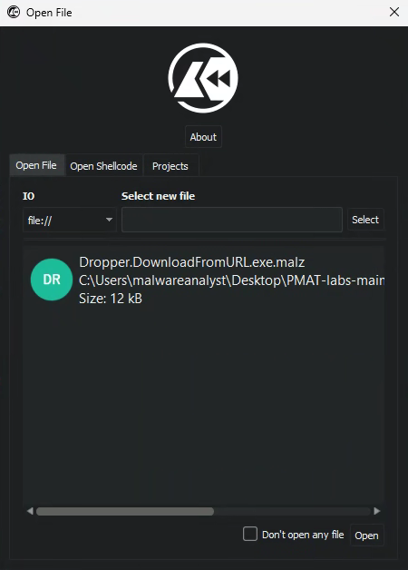
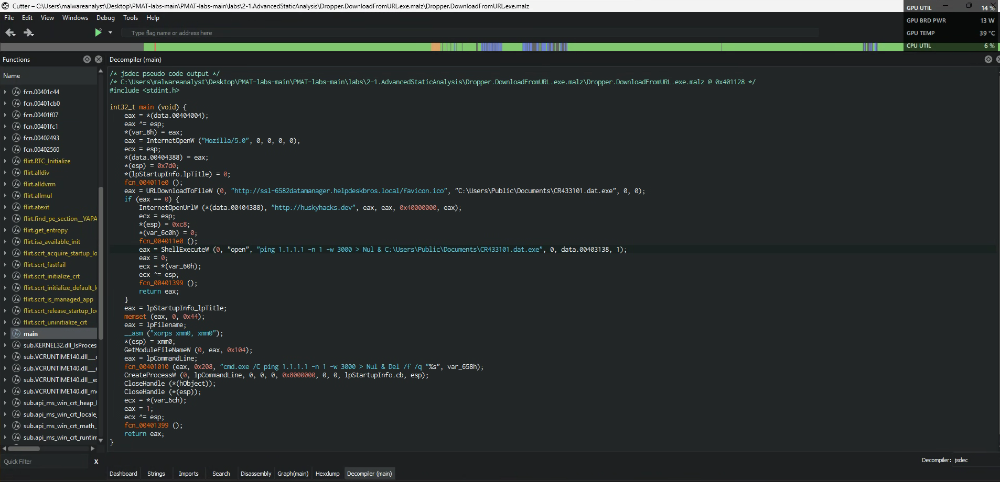

# Static Analysis

## Table of Contents
[Disassembling With Cutter 🛠️](#disassembling-with-cutter)  

  

## Disassembling With Cutter

Cutter is an advanced, open-source reverse engineering tool. It can be used to decompile and disassemble malware:

  

When an executable is disassembled we can view the assembly code of the executable. 

  

Within assembly there is a central function known as the `MAIN` function and Cutter will identify where the `MAIN` function is. The `MAIN` function, in simple terms, contains the actions an executable will take once it's executed. For example, reviewing the `MAIN` function below reveals that the executable is perform some actions we saw previously in static analysis:

  

Cutter also has a graph function that can layout the flow of an application. This can be useful if an executable has a conditional branching:

  

Lastly, we can use the decompiler tool within Cutter, which will try to replicate the source code of an executable for analysis:

  

From here, we can review the parts of the binary and piece together what may be going on. For example, we can jump to calls for Windows APIs and check what is being pushed to these APIs.

