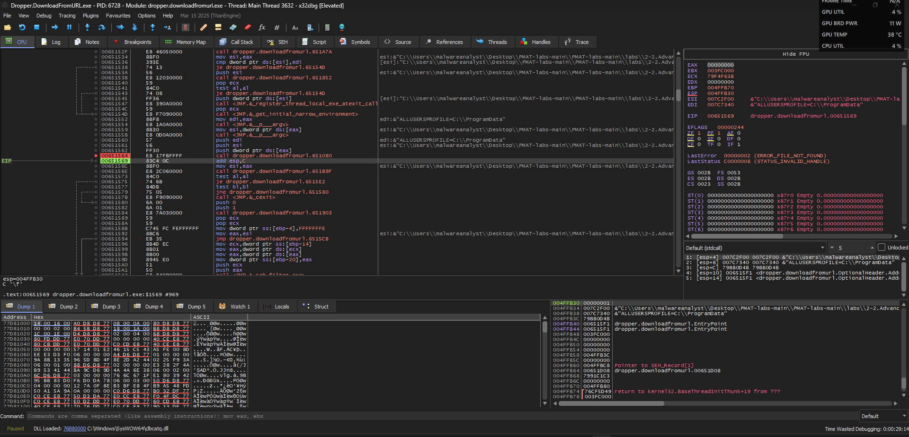
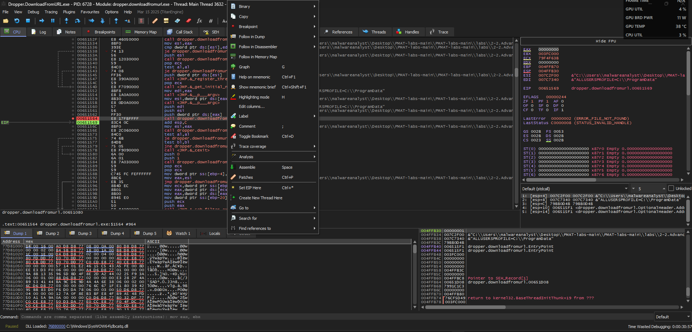

# Advanced Dynamic Analysis

## Table of Contents
[Debugging Binaries 🕷️](#debugging-binaries)  

  

## Debugging Binaries

Debugging is the process of identifying, analyzing, and fixing errors or unintended behavior in software. It’s a critical part of development, reverse engineering, and malware analysis. 
**x32dbg** is a graphical user interface (GUI) debugger for Windows 32-bit executables. It’s part of the **x64dbg** project, which includes:

- `x32dbg` → for debugging **32-bit applications**
- `x64dbg` → for debugging **64-bit applications**

  

Once you've attached malware to the debugger, you can run the malware with `F9` and it'll run until it reaches its entry point. Afterwards, you can use `F8` to continue on into the next set of instructions. Once you find an instruction that actually executes (it'll hand in debugger for a moment), you can `Right Click` and `Follow in Disassembler`

  

Here we can see something similar to what we found in Cutter, but the malware is actually running so we can see the actual data being written to memory:

  

