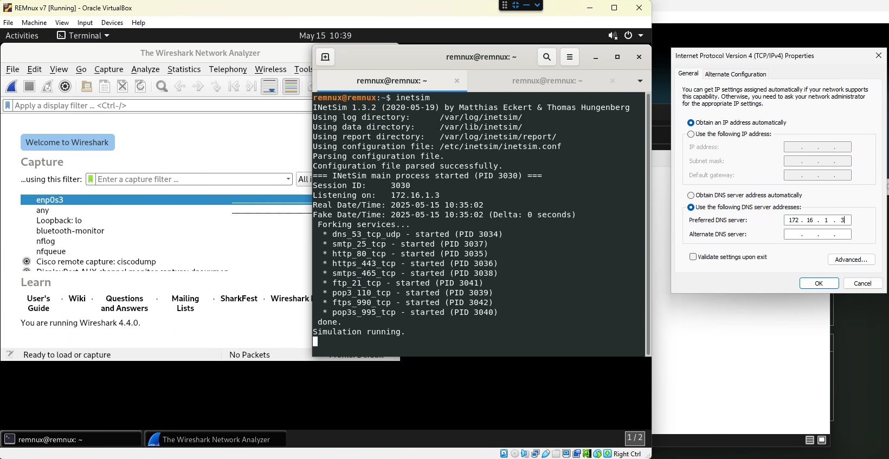
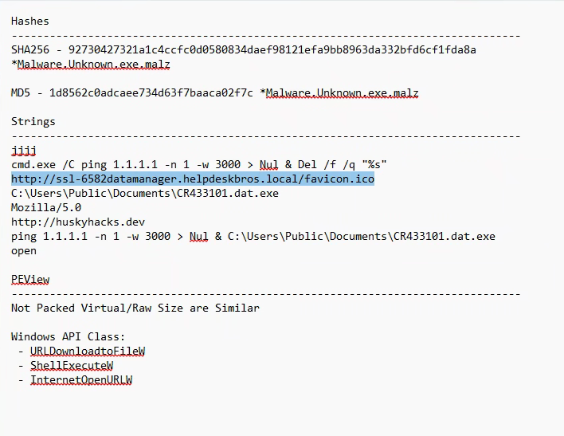
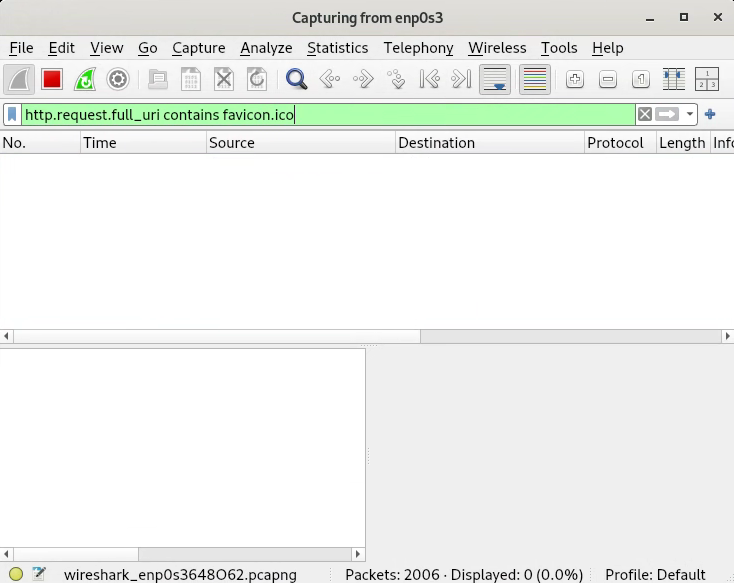
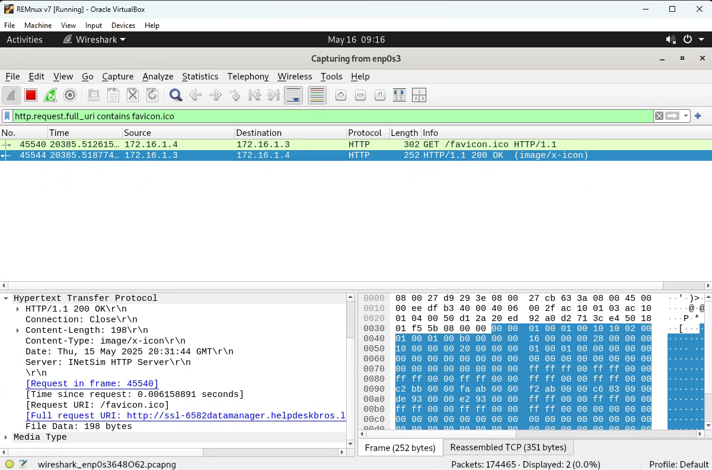

# Dynamic Analysis

## Table of Contents
[Before Running the Malware](#before-running-the-malware)  
[Running Malware](#running-malware-and-network-signatures)  
[Host-Based Indicators](#host-based-indiciators)  
[PEStudio](#pestudio) 

  

## Before Running The Malware

Before we run the malware for Dynamic Analysis we want to ensure our environment is set up to capture any network traffic that may be occurring. Within Remnux we want to ensure INetSim is running, as well as WireShark, and on the Flare-VM host we want to ensure that our DNS is configured to be the Remnux host:

  

Next, we can use information gathered from our Static Analysis to configure WireShark to search for certain traffic:

  

We can have WireShark search for HTTP request with certain parts of the URL

  

## Running Malware and Network Signatures

We can run the malware on our Flare-VM and monitor the network behavior on our Remnux machine in WireShark:

  

  <strong>FLOSS Output</strong> 
  
   
  

## Host Based Indicators

Another tool that can assist in static analysis of malware is PEViewer. This tool will allow us to view the structure of the binary and the date it was compiled, along with other information. For example when we open the binary in PEView we can check the Magic Number to determine what kind of binary it is: 

  

We can also see the date the binary was compiled by going to IMAGE_NT_HEADER → IMAGE_FILE_HEADER and viewing the Time Date Stamp: 

  

 

We can then compare the Virtual Size and the Raw Data Size in the IMAGE_SECTION_HEADER .text section to determine if the malware is packed or unpacked. If the virtual size is significantly larger than the Raw Data Size than it is safe to assume that the malware is packed. We can convert the HEX Data Value to determine the size in bytes using the programmer calculator:

  

 

Now looking at a packed Malware we notice certain differences like SECTION UPX0 which is an indicator that the binary was packed with the UPX packer. We can also see that in the IMPORT Address Table is significantly smaller than a normal IMPORT Address Table would be.

  

 

We can also compare virtual size and raw data size and now we notice there is a big difference in size:

  

 

We can also check what Windows APIs the binary may be leveraging under SECTION.rdata → IMPORT Address Table. We can also check if the APIs are commonly used by malicious binaries by checking MalAPI.io or reading the Windows Documentation:

  

 

## PEStudio

Lastly we can automate a lot of these processes by using a tool known as PEStudio. PEStudio can generate file hashes, pull strings from binaries, view libraries and identify potentially malicious ones, etc.:

  

 
