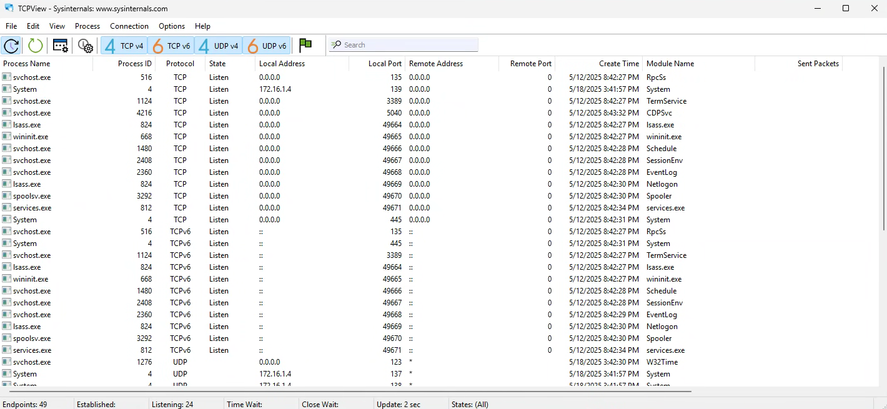

# Dynamic Analysis

## Table of Contents
- [Before Running the Malware](#before-running-the-malware)  
- [Running Malware and Network Signatures](#running-malware-and-network-signatures)  
- [Host-Based Indicators](#host-based-indicators)
  - [Procmon](#procmon)
  - [TCPView](#tcpview) 

  

## Before Running the Malware

Before we run the malware for Dynamic Analysis, we want to ensure our environment is set up to capture any network traffic that may be occurring. Within Remnux, we want to ensure INetSim is running, as well as Wireshark, and on the Flare-VM host we want to ensure that our DNS is configured to be the Remnux host:

  

Next, we can use information gathered from our Static Analysis to configure Wireshark to search for certain traffic:

  

We can have Wireshark search for HTTP requests with certain parts of the URL:

  

## Running Malware and Network Signatures

We can run the malware on our Flare-VM and monitor the network behavior on our Remnux machine in Wireshark:

  

  <strong>FLOSS Output</strong> 
   
  

## Host-Based Indicators

After analyzing what the malware could be doing on the network, it is imperative that we revert to a clean snapshot of our Flare-VM. Since we were focused on the network actions the malware was taking we didn't analyze what it was doing on the host. We can monitor host activity using a tool known as Procmon

## Procmon

  

We can run the malware and filter procmon to display actions taken by the malware:

  

Now when we run the malware we can see all the actions the malware takes:

  

From here we would want to monitor the actions the malware takes like making changes to the registry or creating files. We should also run the malware without INetSim running to see how the malware interacts with the host if it's not connected to the network:

  

## TCPView

TCPView is a Windows program that will show you detailed listings of all TCP and UDP endpoints on your system, including the local and remote addresses and state of TCP connections. TCPView also reports the name of the process that owns the endpoint.

  

This tool is useful because it can monitor TCP connections made locally that WireShark won't be able to capture:

  

