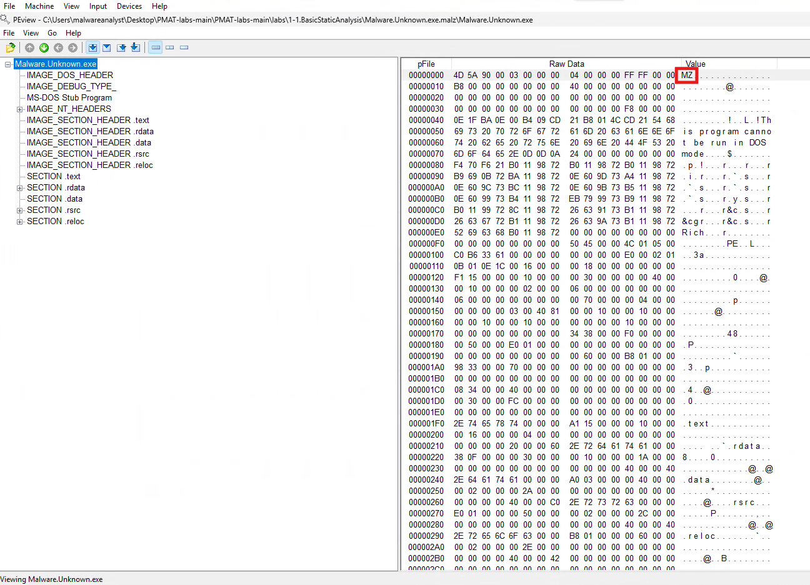

# Static Analysis

## Table of Contents
[Hashing Malware](#hashing-malware)  
[Strings and FLOSS](#strings-and-floss)  
[PEView Analysis](#peview)  

  

## Hashing Malware

The first thing an analyst should do when working with malware is to gather the binary's hash and compare it to a known hash. If there is no known hash, the analyst should still collect it:

  

  

These hashes can be submitted to tools like VirusTotal to help identify the malware.

## Strings and FLOSS

Strings and FLOSS are tools that can be used to extract an array of characters (typically longer than 4 bytes) from a binary. FLOSS offers enhanced functionality by analyzing and compiling obfuscated strings, presenting them in the output.

  <strong>Strings Output</strong> 
  

  <strong>FLOSS Output</strong> 
  
   
  

## PEView
Another tool that can assist in static analysis of malware is PEViewer. This tool will allow us to view the structure of the binary and the date it was compiled, along with other information. For example when we open the binary in PEView we can check the Magic Number to determine what kind of binary it is: 

  

We can also see the date the binary was compiled by going to IMAGE_NT_HEADER → IMAGE_FILE_HEADER and viewing the Time Date Stamp: 

  

 

We can then compare the Virtual Size and the Raw Data Size in the IMAGE_SECTION_HEADER .text section to determine if the malware is packed or unpacked. If the virtual size is significantly larger than the Raw Data Size than it is safe to assume that the malware is packed. We can convert the HEX Data Value to determine the size in bytes using the programmer calculator:

  

 

  

 
