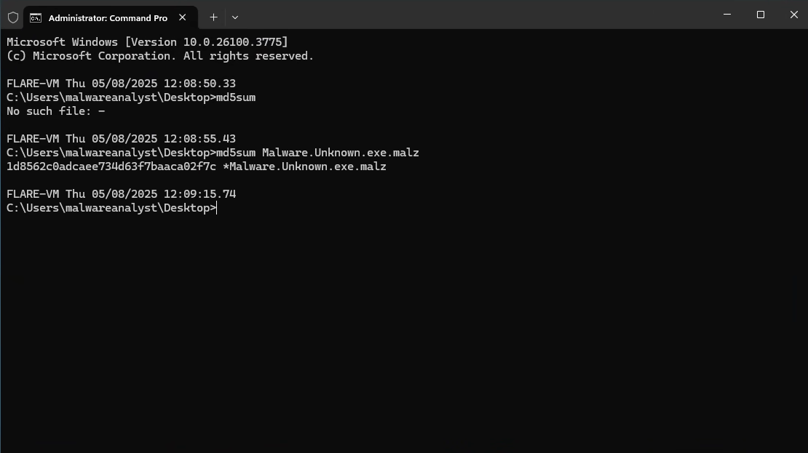
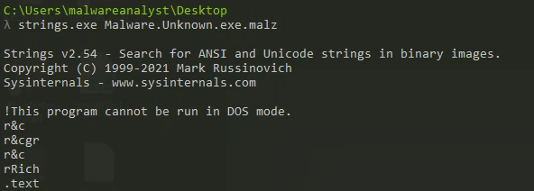
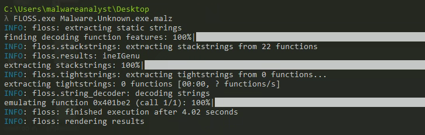

# Static Analysis

## Table of Contents
[Hashing Malware](#hashing-malware)  
[Strings and FLOSS](#strings-and-floss)  
[PEViewer Analysis](#peviewer)  

  

## Hashing Malware

The first thing an analyst should do when working with malware is to gather the binary's hash and compare it to a known hash. If there is no known hash, the analyst should still collect it:

  

  

These hashes can be submitted to tools like VirusTotal to help identify the malware.

## Strings and FLOSS

Strings and FLOSS are tools that can be used to extract an array of characters (typically longer than 4 bytes) from a binary. FLOSS offers enhanced functionality by analyzing and compiling obfuscated strings, presenting them in the output.

  <strong>Strings Output</strong> 
  

  <strong>FLOSS Output</strong> 
  
   
  

## PEViewer
